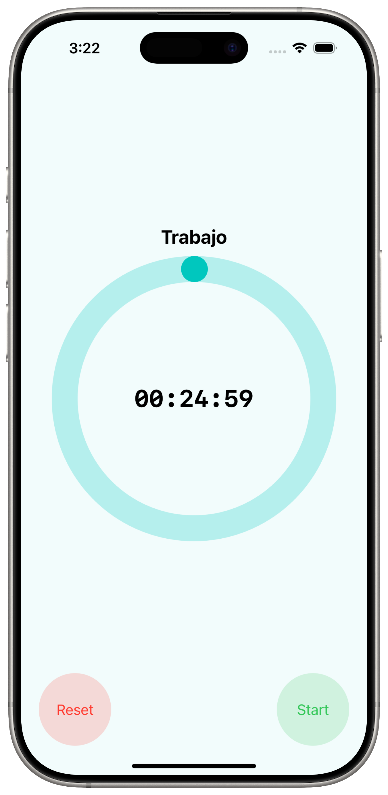
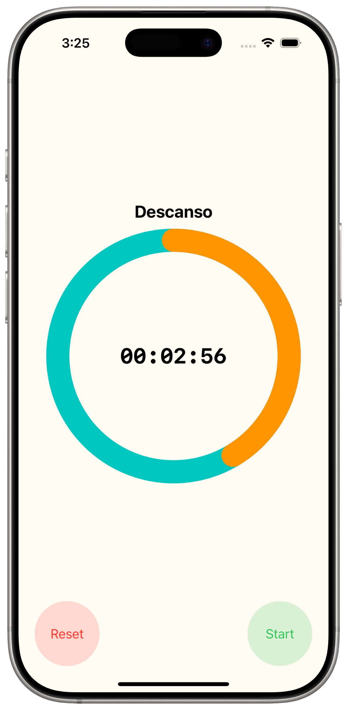
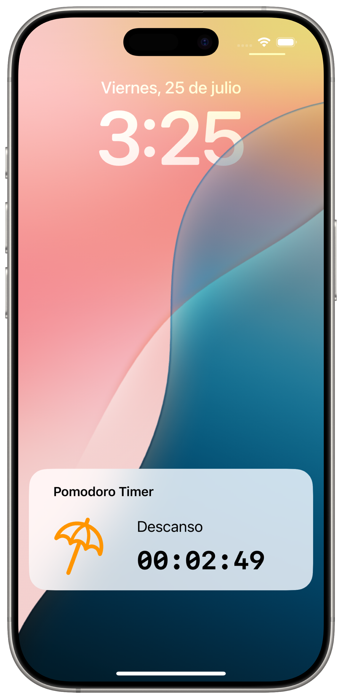
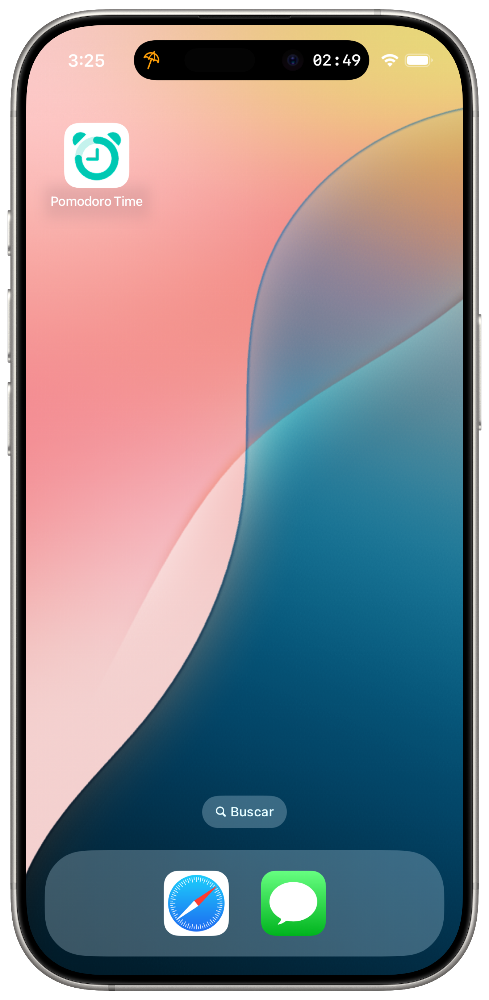

# Pomodoro Timer

A simple Pomodoro timer with Live Activity support. Track your work and break intervals while keeping progress visible on the Lock Screen or Dynamic Island.

## Features

- ⏱️ Pomodoro timer with work/break intervals
- 📳 Live Activities with real-time updates
- 🏝️ Dynamic Island support (expanded and compact)
- 🔒 Lock Screen visualization
## Requirements

- Xcode 15
- iOS 17 or later

## Build & Run

1. Open `PomodoroTimer.xcodeproj` in Xcode.
2. Select the `PomodoroTimer` scheme.
3. Build and run on an iOS 17+ device or simulator.

## Live Activity

Starting a timer launches a Live Activity to show the remaining time. Progress updates live on the Lock Screen and in the Dynamic Island. When the work interval ends, the Live Activity switches to break mode and continues updating until the timer completes or is stopped.

## Screenshots
| Work Screen | Break Screen | Lock Screen | Dynamic Island |
|-------------|---------------|-------------|---------------|
|||||
| | | ||

## About
> 🧪 This project was created as a personal experiment to learn how to implement Live Activities and Dynamic Island support in iOS apps.
> Feel free to use or modify this project for learning purposes.

## License
This project is licensed under the [MIT License](LICENSE).
